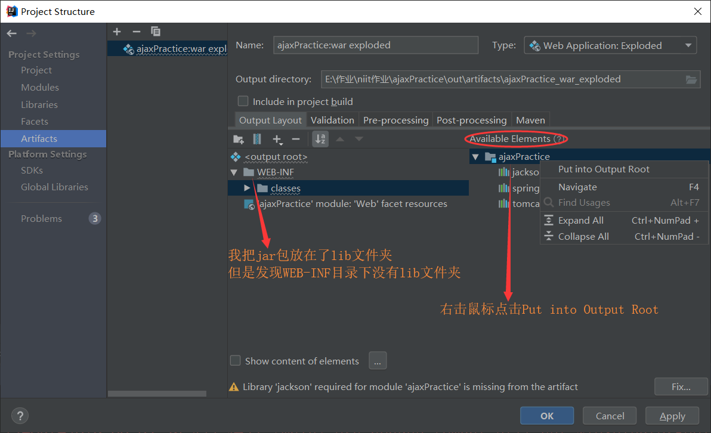

# 解决IDEA在部署`spingMVC`项目时报`class not found Exception`

> 最近一次在部署springMVC项目时 在添加了`jar`包的情况下报错：
>
> `java.lang.ClassNotFoundException:org.springframework.web.context.ContextLoaderListener`

**解决方法：**

点击`Project Structure`  -> `Artifacts`

